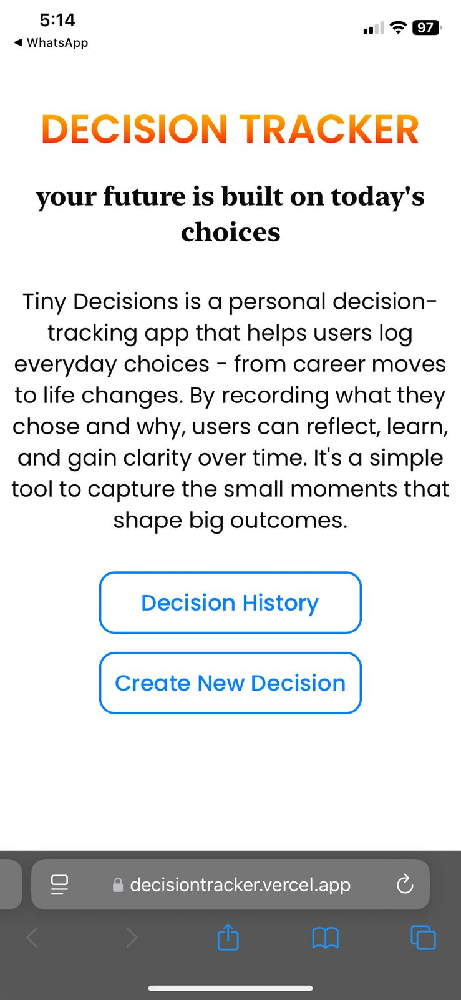
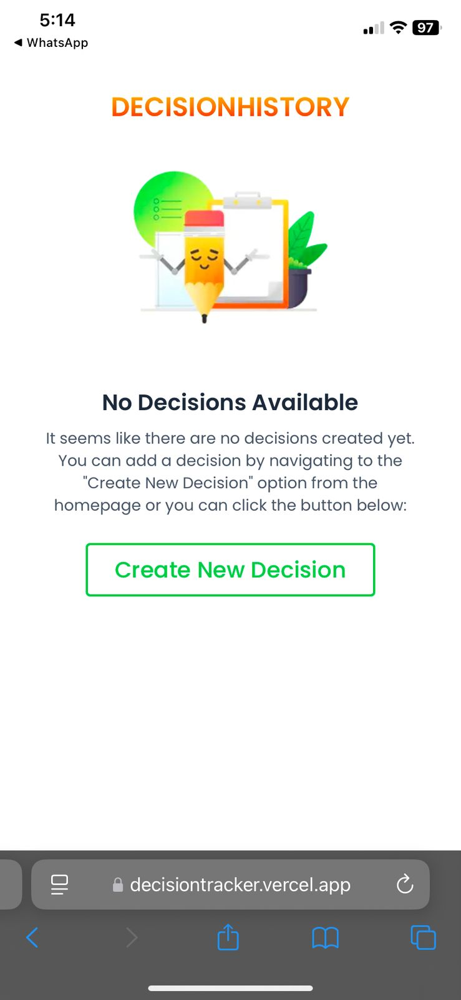
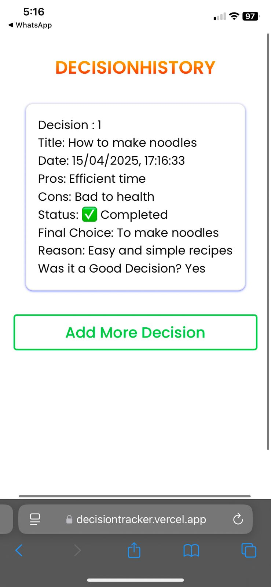
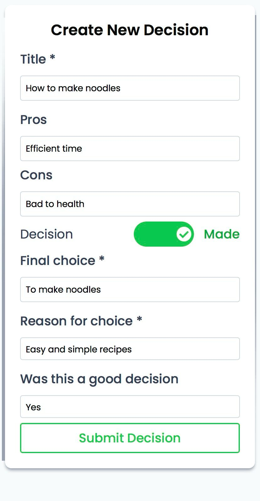
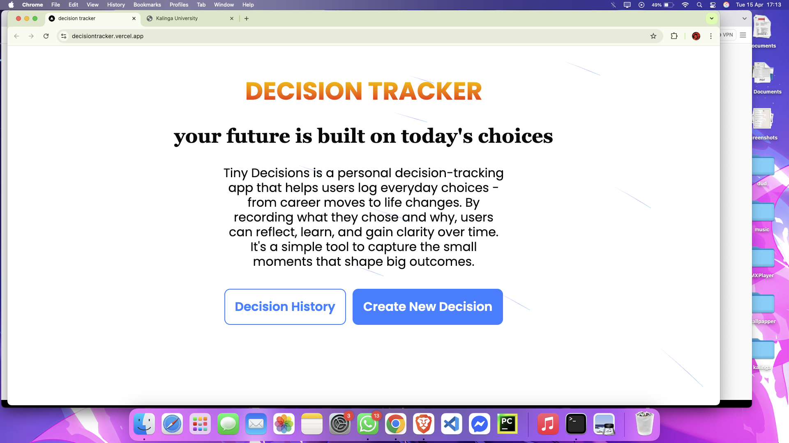
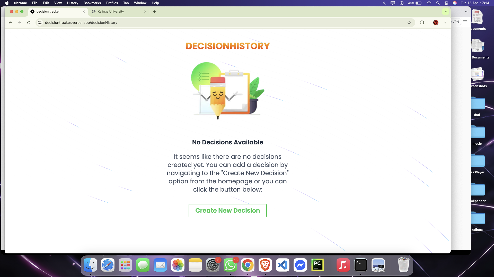
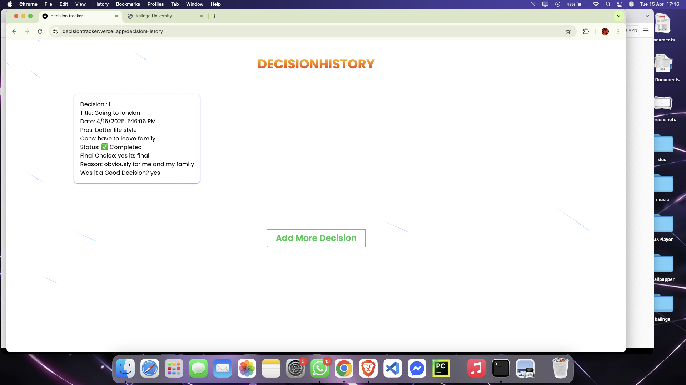
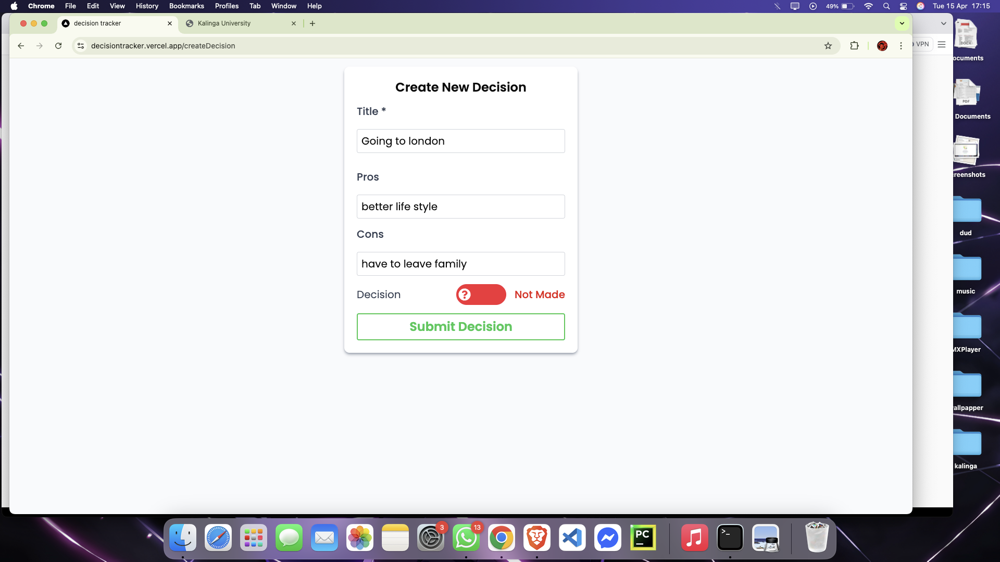

# DECISION TRACKER

[Live Preview](https://decisiontracker.vercel.app/) 👉 https://decisiontracker.vercel.app/

## Built With

- [Next.js](https://nextjs.org/) – React framework for production-grade apps
- [React](https://reactjs.org/) – Library for building user interfaces
- [Tailwind CSS](https://tailwindcss.com/) – Utility-first CSS framework for styling
- [Framer Motion](https://www.framer.com/motion/) – Animation library for React but used pre-build component

## Getting Started

### to install the required dependencies

```
npm install
```

### to run the development server

```
npm run dev
```

Open [http://localhost:3000](http://localhost:3000) with your browser to see the result.

## What achieved

1.  [Landing page](https://decisiontracker.vercel.app/) for better approach of designing the website
    <br>
    -> Landing page

    
    <br>
    in the landing page, provided two routes for (A) Decision History (B) Create New Decision
    <br>

    as mentioned in the task
    <br>
    (A) Decision History - if some already decisions have been made
    <br>
    In decision history, there is two UI, as one before having some decision already listed and other when some decision have been added

        -> Without decisions list

    

        -> With decisions list

    

       <br>
       (B) Create New Decision - to add new decision and i made it in two part as
       <br>
       -> Create Decision

    
    <br>
    (i) Pending or not marked - which have title as required attribute and pros and cons as optional
    <br>
    -> Before marked or completed
    
    <br>
    (ii) Completed or marked - which have final choice and reason for choice as required and is this good decision as optional
    <br>
    -> After marked or completed
    

## What could be done further

(A) Authentication could be implemented - for a specific user, it could have registration process to use
<br>
I tried to implement authentication process using localStorage but due to overburdening it, i just made the UI and work flow part, but further cut it out from the process, as it doesn't affect current process even if there is no authentication

(B) Manual filter or sorting - allowing users to manually sort or filter out the decisions, based on date, or based on priority.

(C) Editable decision - allowing users to be able to update the decision or even if deleting option for particular decisions.

## Some screenshots in different devices

(A) Mobile device - iphone 11

1. Landing Page
   

2. Without decisions
   

3. With decisions
   

4. Create decisions
   

(B) Mac book m1

1. Landing Page
   

2. Without decisions
   

3. With decisions
   

4. Create decisions
   
